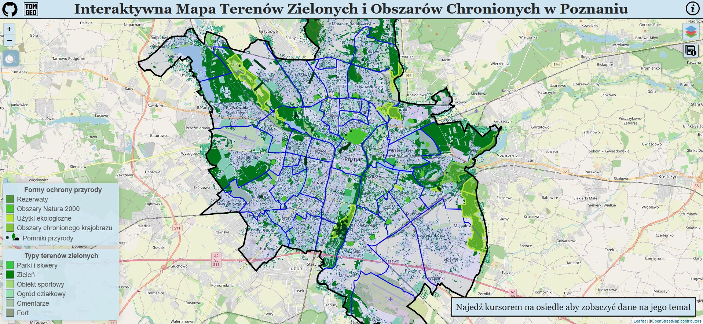

# Interaktywna mapa terenów zielonych i obszarów chronionych Poznania

Mapa powstała jako mój projekt zaliczeniowy z przedmiotu Kartografia Internetowa.
Mapę znajdziesz pod adresem [https://tomekmatuszek.github.io/zielony-poznan/](https://tomekmatuszek.github.io/zielony-poznan/).

